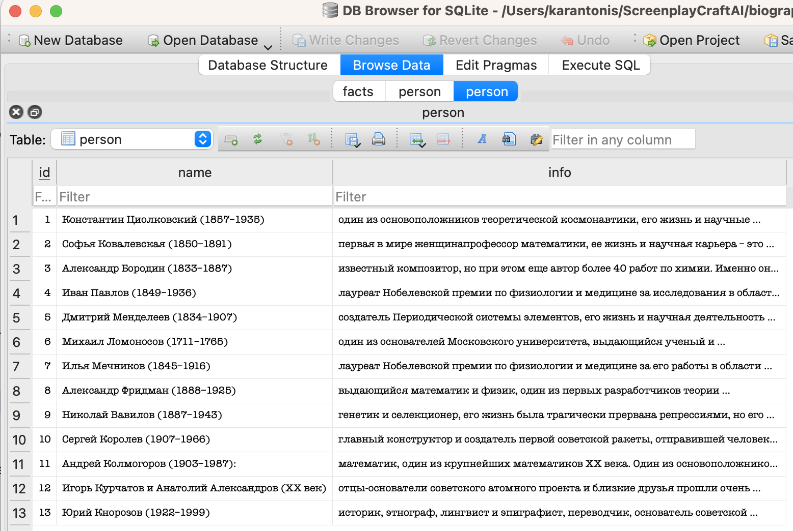
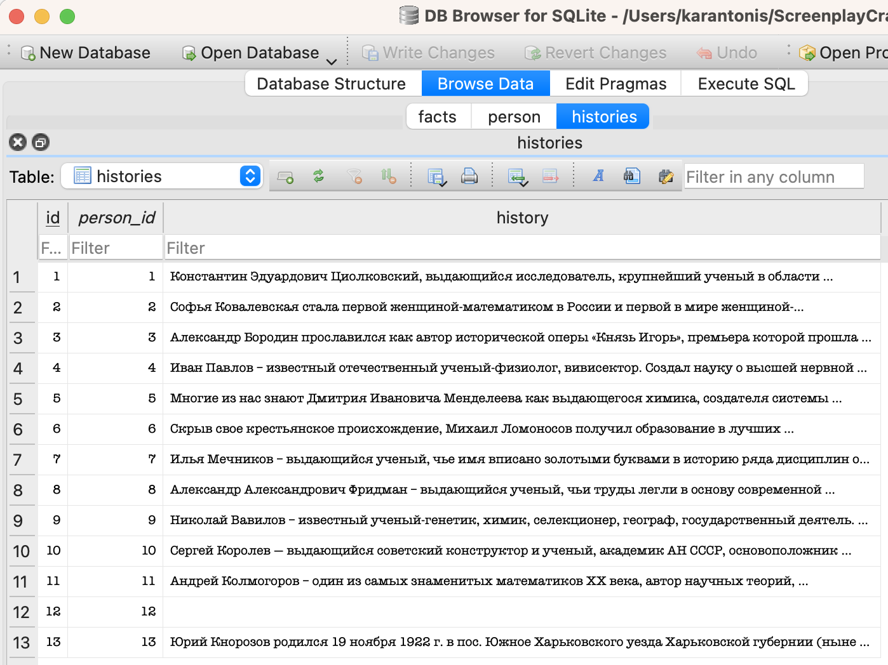

# ScreenplayCraftAI

Мы предлагаем решение задачи генерации сценариев для художественных биографических фильмов/сериалов с помощью LLM.

## Arhitecture

- С целью унификации использования различных API для работы с LLM мы создали класс ModelWrapper (см. [model.py](model.py)), который позволяет общаться с агентом в режиме текстовой генерации.

    **Замечание.** На данный момент поддерживается только Mistral AI API.

- Для создания форматированных промптов (запросов) мы создали класс RequestManager (см. [request_utils.py](request_utils.py)), который позволяет структурировать запрос на основе "сырых данных".

    **Замечание.** На данный момент класс позволяет составлять запрос о генерации сценария фильма о конкретном человеке.

- "Сырые данные" представляют из себя таблицы с атрибутами, свойствами и характеристиками о конкретной персоне. Они хранятся в базе данных [biography_storage.db](biography_storage.db). На данный момент имеются следующие таблицы:
  - person: содержит в себе имя человека и краткую информацию о нём (поля name и info) 

  - facts: содержит факты о персонах, которые либо нужно освещать в сценарии, либо не нужно (поля person_id, fact и include)

  - histories: содержит истории о персонах (поля person_id и history) 
  
  **Замечание.** На данный момент в базе данных лежат истории и сюжеты из источников https://www.culture.ru/ и https://biographe.ru/

## Usage

Для запуска приложения используйте следующую команду (из корневой директории репозитория):

```angular2html
python .\main.py --use_histories=1 --use_facts=1 
```

где флаги use_histories и use_facts отвечают за использование/неиспользование историй и фактов о персоне в запросе.

Вы процессе работы с программой вам доступны 4 опции:

0. "Quit"
1. "Generate screenplay"
2. "Print available persons"
3. "Get person info by id"

Таким образом, для генерации сценария о персоне вам нужно выбрать первую опцию и ввести id персоны. Сгенерированные промпт и сценарий сохранятся в текстовых файлах result_prompt.txt и result_script.txt соответственно.

Мы замерили время генерации сценария для 13 персон. Результаты:

1. Константин Циолковский: 256.6s
2. Софья Ковалевская: 136.6s
3. Александр Бородин: 207.1s
4. Иван Павлов: 180.3s
5. Дмитрий Менделеев: 313.5s
6. Михаил Ломоносов: 148.4s
7. Илья Мечников: 70.9s
8. Александр Фридман: 138.8s
9. Николай Вавилов: 155.9s
10. Сергей Королев: 158.2s
11. Андрей Колмогоров: 356.4s
12. Игорь Курчатов и Анатолий Александров: 126.9s
13. Юрий Кнорозов: 81.9s

## Results

### Attempt 1

Mistral AI генерирует относительно слабые сценарии, решения OpenAI генерируют куда более качественные постановки:

- Пример генерации модели mistral-large-latest: [directory](mistral-ai)
- Пример генерации модели o1-preview: [google-drive](https://drive.google.com/drive/folders/1RxUrMG-QaTYtsRX5a2iCfbrUQzG9ajpw?usp=sharing)

### Attempt 2

Попробовали улучшить сценарии путём обогащения каждой из сцен отдельным запросом в мистраль: [improved_mistral_results](improved_mistral_results)

### Attempt 3

Вместо попыток сгенерировать полный сценарий со всеми подробностями мы решили разбить задачу на 2 части:

1. Сгенерировать подробный план по сценарию через GPT-4 от OpenAI (пока что вручную, т.к. нет доступа к API). Планы тут: [mistral](outlined_mistral) и [gpt-4](outlined_openai)
2. Сгенерировать подробное описание для каждой сцены плана

Результаты: todo
